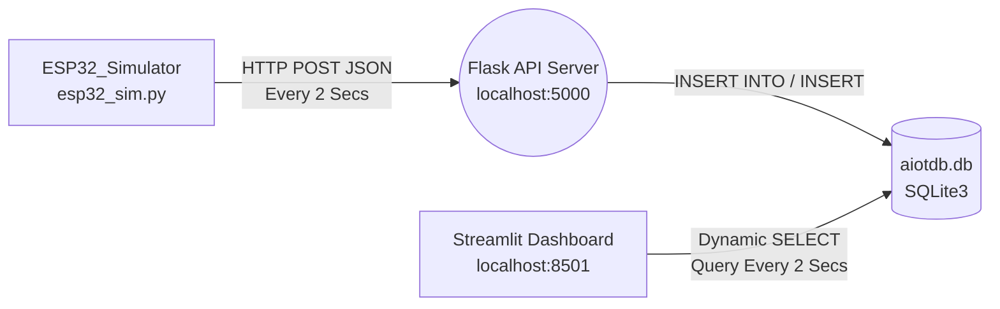

# AIoT System Demo (DIC4 HW1)

這是一個完整的在地端 (Local) 模擬 AIoT 架構系統。包含後端資料接收、資料庫儲存、感測資料傳送（完美模擬真實硬體），以及前端資料的視覺化動態匯出，完全對齊課程硬體實作的需求。

## 🎯 專案目標達成項目 (Tasks Completed)

- [x] **Generate Data**: 使用 `esp32_sim.py` 撰寫 Python 邏輯，每隔 **2秒** 產生並模擬發送隨機的 DHT11 溫濕度訊號與硬體 Metadata。
- [x] **Store in Database**: 透過 `flask_app.py` 的 `/sensor` (HTTP POST) 端點接收資料，並直接動態存入 **SQLite3 資料庫 `aiotdb.db` 的 `sensors` table 欄位中**。
- [x] **Dynamic Query & Chart Visualization**: 在 `streamlit_app.py` 中即時動態連線至資料庫取得歷史與現有資料，並利用背景不間斷刷新機制 (Dynamic Auto-refresh)，在網頁介面上畫出溫度與濕度的獨立折線圖、資料表以及最高/平均算術 KPI。

## 📁 主要檔案結構 (File Structure)

| 檔案名稱 | 用途說明 |
| :--- | :--- |
| `flask_app.py` | Flask 後端 API 伺服器。 對內負責建立 SQLite 資料表，對外開放 `5000` port 提供裝置傳輸 `JSON` 結構，以及 `/health` 系統線上健康度唯美檢視頁。 |
| `esp32_sim.py` | ESP32 傳輸模擬器。每 2 秒定時發送亂數產生之溫度、濕度以及連線 IP 標籤予 Flask。 |
| `streamlit_app.py` | Streamlit 前端戰情室。顯示最新溫度狀態 (Latest Temperature)、歷史動態折線圖以及完整資料庫存取 Table。 |
| `aiotdb.db` | SQLite 關聯式資料庫檔案 (當第一筆資料寫入時會由程式自動生成與建立 Schema)。 |
| `requirements.txt`| 本專案所有的 Python 相依套件版本 (包含 flask, pandas, requests, streamlit)。 |
| `venv/` | 完整的 Python 專用隔離虛擬環境 (Virtual Environment)。 |
| `commands.txt` | 記錄所有未來你要「重新開啟」與系統發生異常時用來「強制關閉」的對應指令表。 |

## 🚀 系統架構流程 (Data Flow Chart)

## 💻 如何執行 (How to Run)
詳細的指令清單可以參考我為你準備的 `commands.txt` 檔案！
1. 確保 Python 虛擬環境 (`venv`) 準備妥當。
2. 開啟三個各自獨立的終端機 (cmd/Powershell)，分別下達啟動指令執行那三支 Python：
   - `venv\Scripts\python flask_app.py`
   - `venv\Scripts\python esp32_sim.py`
   - `venv\Scripts\streamlit run streamlit_app.py`
3. 啟動後在網頁瀏覽器觀看成果：
   - 觀看前端圖表 👉 http://localhost:8501
   - 檢查系統健康度 👉 http://localhost:5000/health
